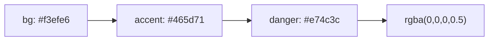

# Color Swatch Test

## 1. Hex Colors (inline code)

### 3-digit hex

`#fff` `#000` `#f00` `#0f0` `#00f` `#abc`

### 6-digit hex

`#ffffff` `#000000` `#ff0000` `#00ff00` `#0000ff` `#f3efe6`

### 4-digit hex (with alpha)

`#fff0` `#f00f` `#0008`

### 8-digit hex (with alpha)

`#ffffff00` `#ff000080` `#00000033`

---

## 2. RGB / RGBA (inline code)

- `rgb(255, 0, 0)` - red
- `rgb(0, 128, 0)` - green
- `rgb(0, 0, 255)` - blue
- `rgba(31, 37, 48, 0.08)` - shadow
- `rgba(255, 255, 255, 0.5)` - semi-transparent white
- `rgba(0, 0, 0, 1)` - opaque black

---

## 3. HSL / HSLA (inline code)

- `hsl(0, 100%, 50%)` - red
- `hsl(120, 100%, 25%)` - dark green
- `hsl(210, 50%, 20%)` - dark blue
- `hsla(0, 100%, 50%, 0.5)` - semi-transparent red
- `hsla(240, 100%, 50%, 0.3)` - semi-transparent blue

---

## 4. Code Block (CSS)

```css
:root {
  --bg: #f3efe6;
  --panel: #fbf8f2;
  --panel-strong: #ffffff;
  --ink: #1f2530;
  --muted: #6d7480;
  --line: #d6d1c6;
  --accent: #465d71;
  --accent-soft: #e1e7ec;
  --success: #dfe8d7;
  --shadow: 0 18px 50px rgba(31, 37, 48, 0.08);
  --radius-xl: 28px;
  --radius-lg: 20px;
}

.button {
  background-color: hsl(210, 50%, 20%);
  color: hsla(0, 0%, 100%, 0.9);
  border: 1px solid rgba(0, 0, 0, 0.1);
}
```

## 5. Code Block (SCSS)

```scss
$primary: #3498db;
$secondary: #2ecc71;
$danger: #e74c3c;
$warning: #f39c12;

.card {
  background: rgba(255, 255, 255, 0.95);
  box-shadow: 0 2px 8px rgba(0, 0, 0, 0.12);
  border-left: 4px solid $primary;
}
```

## 6. Code Block (JSON)

```json
{
  "colors": {
    "background": "#1e1e1e",
    "foreground": "#d4d4d4",
    "accent": "#569cd6",
    "error": "#f44747"
  }
}
```

## 7. Code Block (YAML)

```yaml
theme:
  primary: "#6200ee"
  secondary: "#03dac6"
  background: "#121212"
  surface: "#1e1e1e"
  error: "#cf6679"
```

## 8. Code Block (HTML)

```html
<div style="background-color: #f0f0f0; color: rgba(0, 0, 0, 0.87);">
  <p style="border: 1px solid hsl(0, 0%, 80%);">Hello</p>
</div>
```

## 9. Code Block (JavaScript / TypeScript)

```js
const theme = {
  primary: '#6200ee',
  secondary: '#03dac6',
  overlay: 'rgba(0, 0, 0, 0.5)',
  highlight: 'hsl(45, 100%, 50%)',
};
```

## 10. Code Block (no language)

```
Background: #282c34
Foreground: #abb2bf
Red:        #e06c75
Green:      #98c379
Blue:       #61afef
Cyan:       #56b6c2
Shadow:     rgba(0, 0, 0, 0.2)
Accent:     hsl(220, 80%, 60%)
```

---

## 11. Body Text (non-code)

The primary brand color is #3498db and the secondary color is #2ecc71.

We use rgba(0, 0, 0, 0.08) for subtle shadows and hsl(210, 50%, 20%) for dark text.

The background is set to #f3efe6 for a warm paper-like feel.

### Colors inside other elements

- List item with #ff6347 tomato color
- Another item: rgba(100, 149, 237, 0.8)

> Blockquote with a color: #9b59b6 looks purple.

| Color Name | Hex | RGB |
|---|---|---|
| Coral | #ff7f50 | rgb(255, 127, 80) |
| Teal | #008080 | rgb(0, 128, 128) |
| Gold | #ffd700 | rgb(255, 215, 0) |

**Bold text with #e74c3c red** and *italic text with #2ecc71 green*.

---

## 12. Mermaid Diagram (should NOT show swatches)



---

## 13. Edge Cases

### Multiple colors on one line

`#ff0000` then `#00ff00` then `#0000ff` all on the same line.

### Colors adjacent to punctuation

Color at end of sentence: #ff0000.
Color with comma: #00ff00, next word.
Color in parentheses: (#0000ff).
Color after colon: #abcdef

### Mixed formats in one code block

```css
.mixed {
  color: #333;
  background: rgb(245, 245, 245);
  border-color: hsl(200, 50%, 70%);
  box-shadow: 0 2px 4px rgba(0, 0, 0, 0.15);
  outline: 2px solid hsla(120, 60%, 40%, 0.7);
  text-decoration-color: #c0ffee;
}
```

---

## 14. False Positive Tests (should NOT show swatches)

These should NOT show swatches:

- HTML entity: &#xff;
- URL fragment: https://example.com/#section
- Variable-like: $color-primary
- Too many digits: #1234567890
- Not hex chars: #ghijkl
- Word boundary: the#fff issue (no space before #)
- 5-digit hex: #12345
- 7-digit hex: #1234567
- CSS comment: /* #aabbcc */  (should show in code block though)
