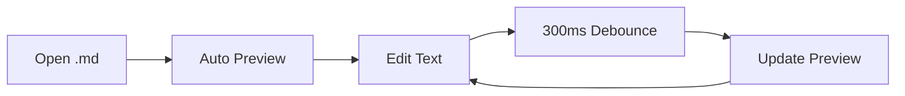

# Combined Feature Test (.markdown extension)

This file uses the `.markdown` extension to verify it is detected as a Markdown file.
The extension checks both `languageId === 'markdown'` and `/\.(?:md|markdown)$/i`.

---

## Frontmatter (none in this file)

This file intentionally has no frontmatter. The preview should start directly with the heading.

## Text Formatting

Regular text, **bold**, *italic*, ***bold italic***, ~~strikethrough~~, and `inline code`.

## Links and Images

[GitHub Repository](https://github.com/santkoh/markdown-multi-tab-preview)


## Lists

- [x] Auto Preview (F-01)
- [x] Multi Tab (F-02)
- [x] Toggle (F-03)
- [x] Mermaid (F-04)
- [x] Real-time Update (F-05)
- [x] Scroll Sync (F-06)
- [x] Syntax Highlight (F-07)
- [x] Frontmatter (F-08)
- [x] Color Swatch (F-09)
- [x] Pan/Zoom (F-10)
- [x] Copy Button (F-11)
- [x] Image Resolve (F-12)

## Blockquote

> This extension provides independent preview panels for each Markdown file.
>
> > Nested: With real-time updates and scroll synchronization.

## Table

| Feature | Test File | Status |
|:--------|:---------:|-------:|
| Basic Markdown | basic.md | Pass |
| Code Highlight | code-highlight.md | Pass |
| Mermaid | mermaid.md | Pass |
| Frontmatter | frontmatter.md | Pass |
| Scroll Sync | long-scroll.md | Pass |
| Color Swatch | color-swatch.md | Pass |

## Code with Highlighting

```typescript
import * as vscode from 'vscode';

// Extension entry point
export function activate(context: vscode.ExtensionContext): void {
  const manager = new PreviewManager(context.extensionUri);
  console.log('Extension activated');
}
```

## Mermaid Diagram



## Color Swatches

- Primary: `#3498db`
- Success: `#2ecc71`
- Danger: `#e74c3c`
- Shadow: `rgba(0, 0, 0, 0.15)`

## Horizontal Rule

---

## End

If this file renders correctly with all features above working, the `.markdown` extension support and overall feature integration are functioning properly.
