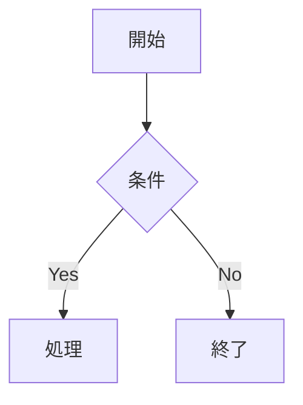

# Diff Preview テストファイル

このファイルは「Show Rich Diff (vs HEAD)」コマンドのテスト用です。
手順: このファイルを編集してコマンドを実行し、差分ハイライトを確認してください。

---

## 段落の変更テスト

ここの文章を書き換えると `diff-removed` / `diff-added` としてハイライトされます。
複数行にわたる段落も含めています。

別の段落です。この段落を丸ごと削除すると左パネルだけ赤くなります。

## 箇条書きの変更テスト

- アイテム A（このリスト全体が変更対象）
- アイテム B
- アイテム C

## テーブルの変更テスト

| 列1 | 列2 | 列3 |
|-----|-----|-----|
| 値1 | 値2 | 値3 |
| 値4 | 値5 | 値6 |

## コードブロックの変更テスト

```python
def hello():
    print("Hello, World!")
    return 42
```

## 見出しの変更テスト

### サブセクション A

サブセクション A の内容です。

### サブセクション B

サブセクション B の内容です。

## Mermaid（MVP では非表示）



## 末尾

ここに新しい段落を追加すると右パネルが緑でハイライトされます。
