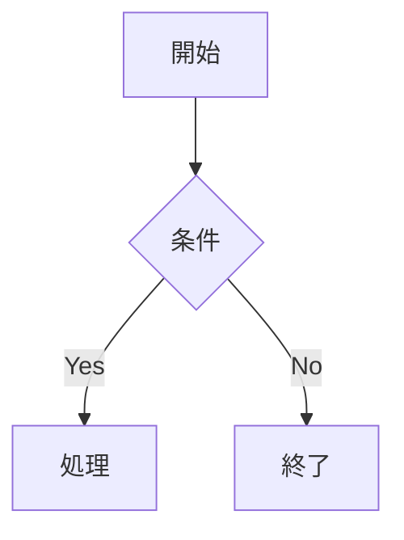

# Diff Preview テストファイル

このファイルは「Show Rich Diff (vs HEAD)」コマンドのテスト用です。
手順: このファイルを編集してコマンドを実行し、差分ハイライトを確認してください。

---

## 段落の変更テスト

ここの文章を **大きく書き換える** と `diff-removed` / `diff-added` としてハイライトされます。
複数行にわたる段落も含めていて、日本語の編集でも行単位の差分が検出されるかを確認します。
3 行目を追加しました（差分パネルで緑ハイライトが入るはず）。

別の段落です。この段落を丸ごと削除すると左パネルだけ赤くなります。

全く新しい段落を末尾に追加しました。緑色のハイライト帯で Rich Diff の視認性を確認できます。

## 箇条書きの変更テスト

- アイテム A（このリスト全体が変更対象）
- アイテム B
- アイテム C

## テーブルの変更テスト

| 列1 | 列2 | 列3 | 列4 (追加) |
|-----|-----|-----|-------------|
| 値1 | 値2 | 値3 | 新規 |
| 値4 | 値5 | 値6 | 新規 |
| 値7 | 値8 | 値9 | 新規行 |

## コードブロックの変更テスト

```python
def hello(name: str = "World") -> int:
    """引数に応じて挨拶文を出力する関数"""
    print(f"Hello, {name}!")
    if name == "World":
        return 42
    return len(name)
```

## 見出しの変更テスト

### サブセクション A

サブセクション A の内容です。

### サブセクション B

サブセクション B の内容です。

## Mermaid（MVP では非表示）



## 末尾

ここに新しい段落を追加すると右パネルが緑でハイライトされます。
