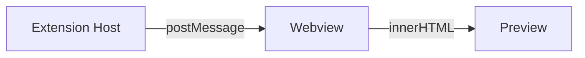

# Long Document for Scroll Sync Test

## Section 1: Introduction

Lorem ipsum dolor sit amet, consectetur adipiscing elit. Sed do eiusmod tempor incididunt ut labore et dolore magna aliqua. Ut enim ad minim veniam, quis nostrud exercitation ullamco laboris.

Duis aute irure dolor in reprehenderit in voluptate velit esse cillum dolore eu fugiat nulla pariatur. Excepteur sint occaecat cupidatat non proident, sunt in culpa qui officia deserunt mollit anim id est laborum.

## Section 2: Architecture

The extension uses a 2-bundle architecture:

- **Extension Host**: Runs in Node.js, handles document events
- **Webview**: Runs in browser, renders mermaid and highlight.js



Lorem ipsum dolor sit amet, consectetur adipiscing elit. Nullam euismod, nisl eget aliquam ultricies, nunc nisl aliquet nunc, quis aliquam nisl nunc quis nisl.

## Section 3: Implementation Details

### 3.1 Preview Manager

The `PreviewManager` class maintains a `Map<string, PreviewPanel>` to track active previews.

```typescript
class PreviewManager {
  private panels = new Map<string, PreviewPanel>();

  openPreview(doc: TextDocument): void {
    const key = doc.uri.toString();
    if (this.panels.has(key)) {
      this.panels.get(key)!.reveal();
      return;
    }
    // Create new panel...
  }
}
```

### 3.2 Markdown Renderer

Custom renderer for `marked` provides:

1. Heading prefix display
2. Mermaid code block detection
3. Image path resolution

### 3.3 Webview Script

The webview script handles:

- Mermaid diagram rendering
- Syntax highlighting with highlight.js
- Scroll position synchronization

## Section 4: Configuration

| Setting | Type | Default | Description |
|---------|------|---------|-------------|
| `autoPreview` | boolean | true | Auto-show preview on open |

## Section 5: Testing

### 5.1 Manual Testing

Open multiple markdown files and verify:

- Each file gets its own preview panel
- Editing updates the preview in real-time
- Scrolling the editor scrolls the preview
- Toggle button shows/hides the preview

### 5.2 Edge Cases

- Empty markdown file
- Very large markdown file
- File with only headings
- File with only code blocks
- File with invalid mermaid syntax

## Section 6: Performance

The extension uses several techniques to maintain performance:

1. **Debounce**: 300ms delay on text changes
2. **Async Mermaid**: Diagram rendering is non-blocking
3. **Retain Context**: `retainContextWhenHidden` prevents re-creation

## Section 7: Security

Content Security Policy (CSP) is configured to:

- Restrict script sources to nonce-based
- Allow inline styles (required by mermaid)
- Limit image sources to webview and HTTPS

## Section 8: Future Improvements

- Bidirectional scroll sync
- Export to PDF
- Custom CSS support
- Math equation rendering (KaTeX)

## Section 9: Changelog

### v0.1.0

- Initial release
- Auto preview on file open
- Multiple independent preview panels
- Mermaid diagram support
- Syntax highlighting
- Scroll synchronization
- Theme support (Light/Dark)

## Section 10: End

This is the end of the long test document. If scroll sync is working correctly, the preview should follow the editor's scroll position proportionally.
