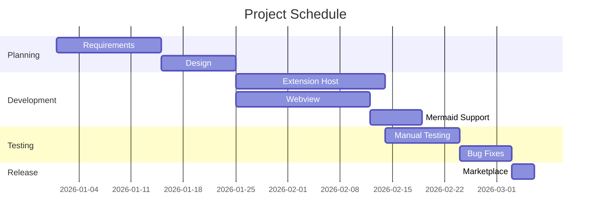
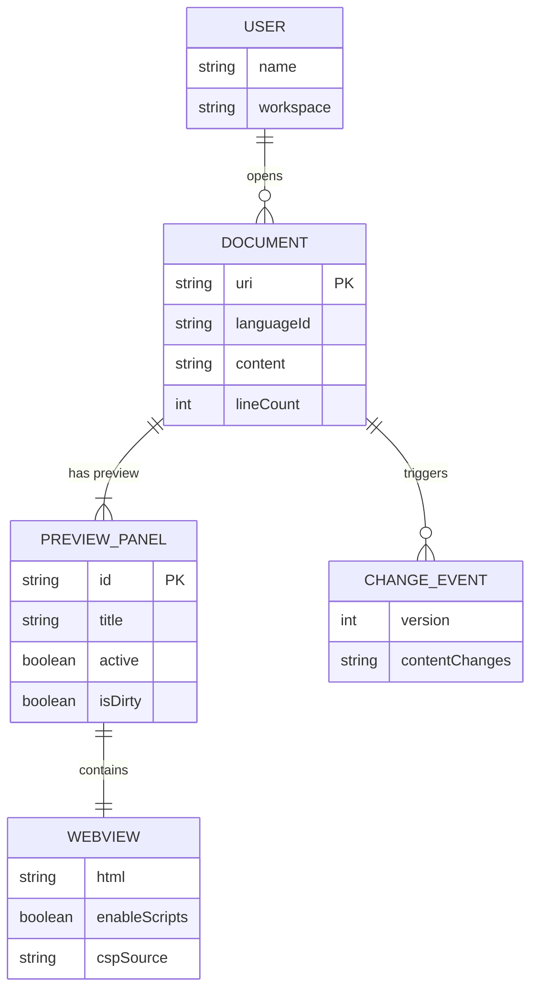
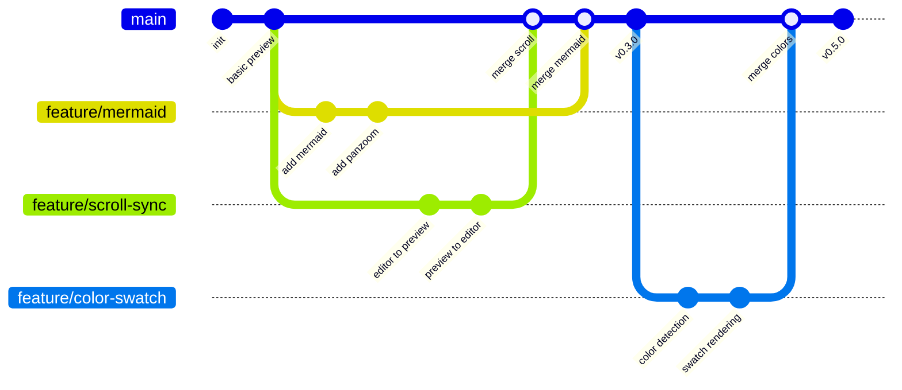
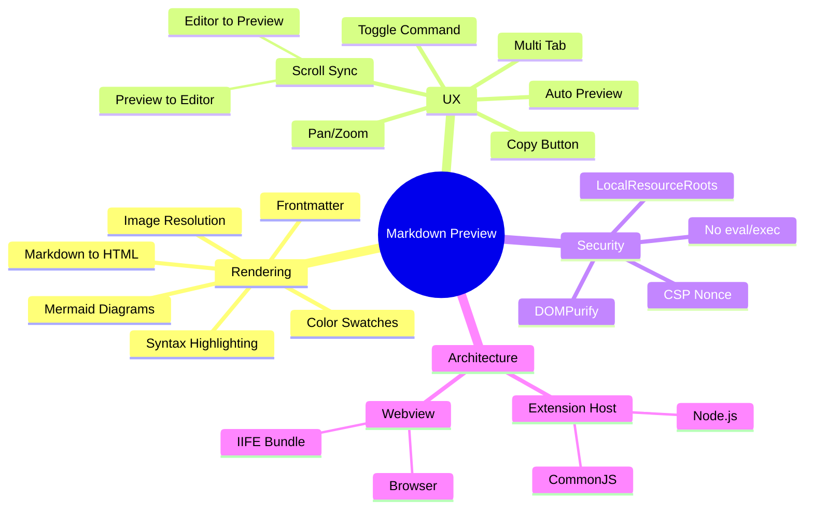
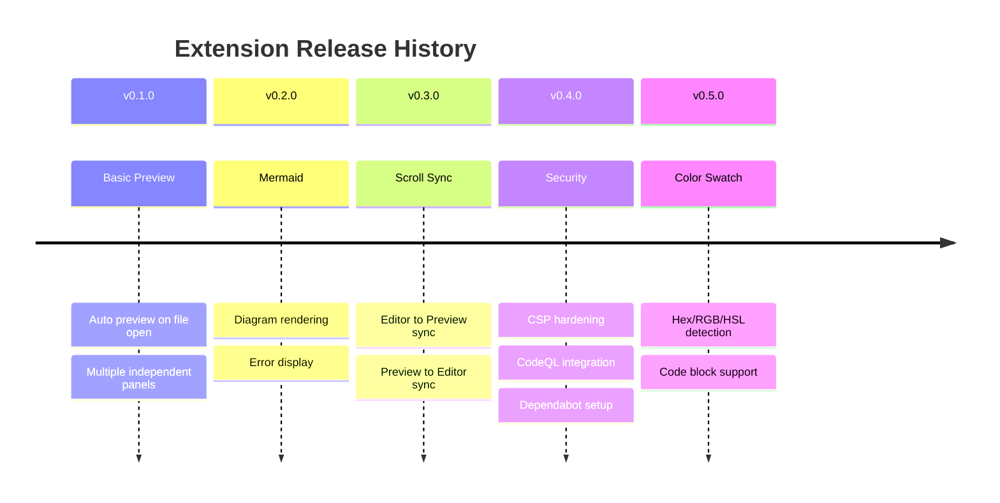
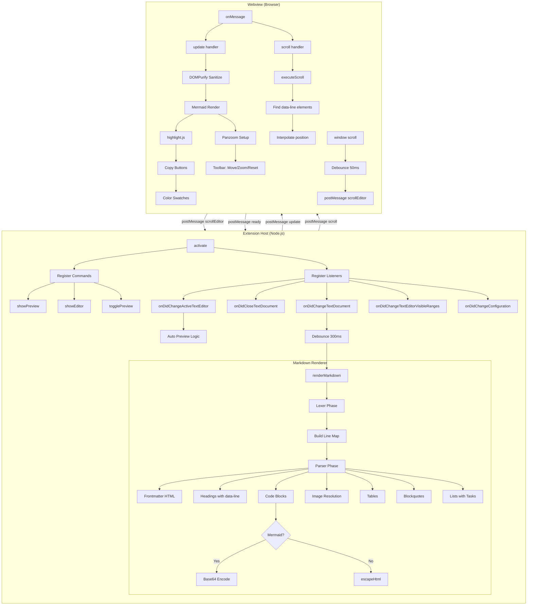
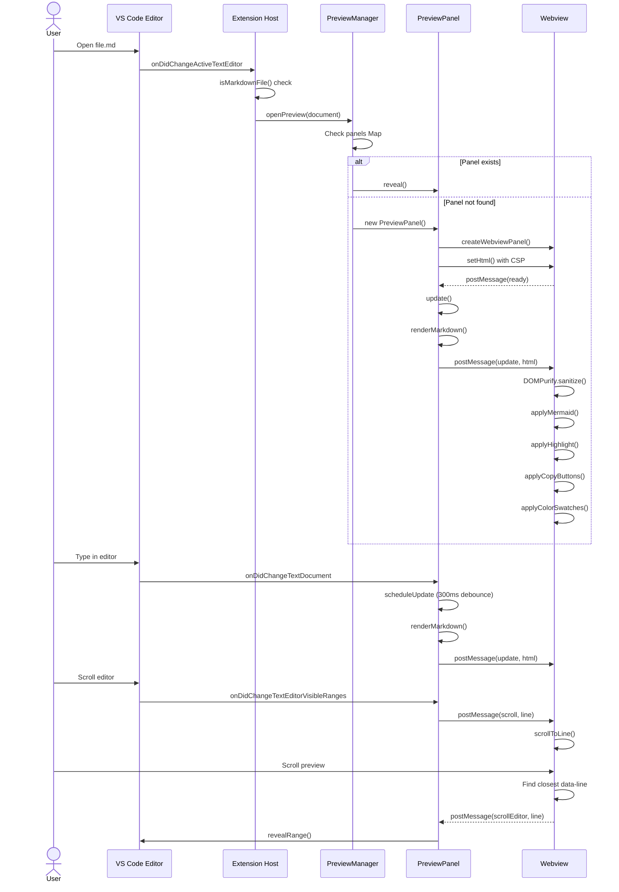

# Mermaid Advanced Diagrams Test

Additional diagram types and complex diagrams for pan/zoom testing.

## 1. Gantt Chart

## 2. ER Diagram

## 3. Git Graph

## 4. Mindmap

## 5. Timeline

## 6. Complex Flowchart (Pan/Zoom Test)

This large diagram is designed to test the pan/zoom toolbar.

## 7. Sequence Diagram with Complex Interactions

---

Test complete. Verify:
- All diagram types render without errors
- Pan/zoom toolbar appears on hover for all diagrams
- Complex diagrams are navigable with pan/zoom controls
- Theme (dark/light) applies to all diagram types
