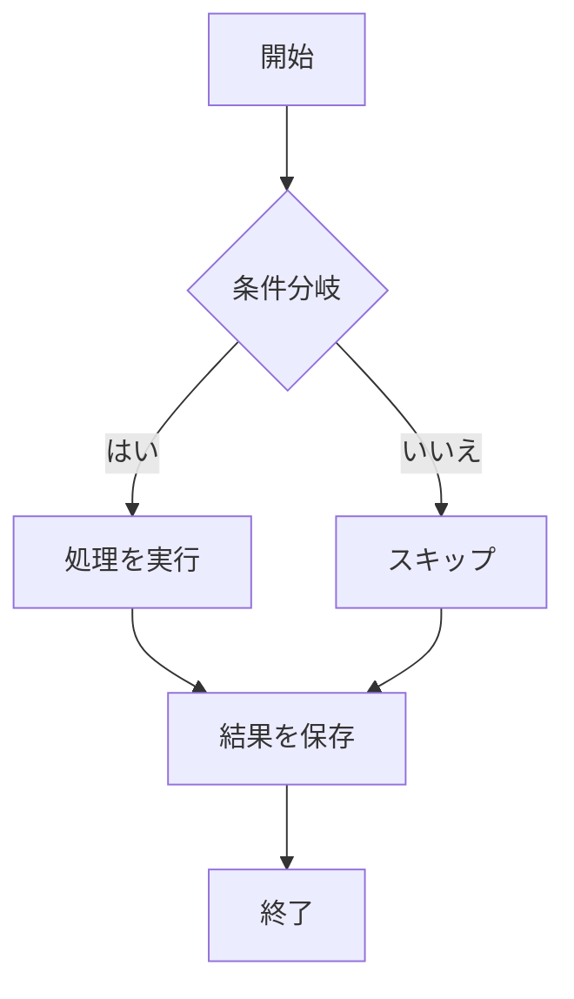
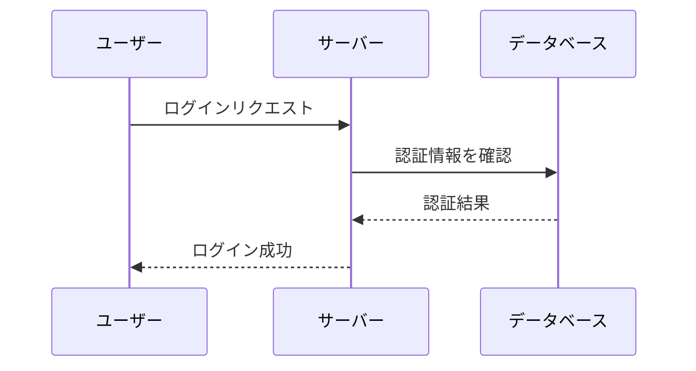
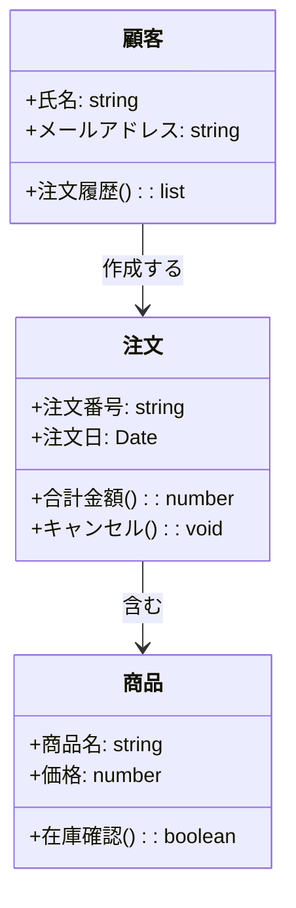
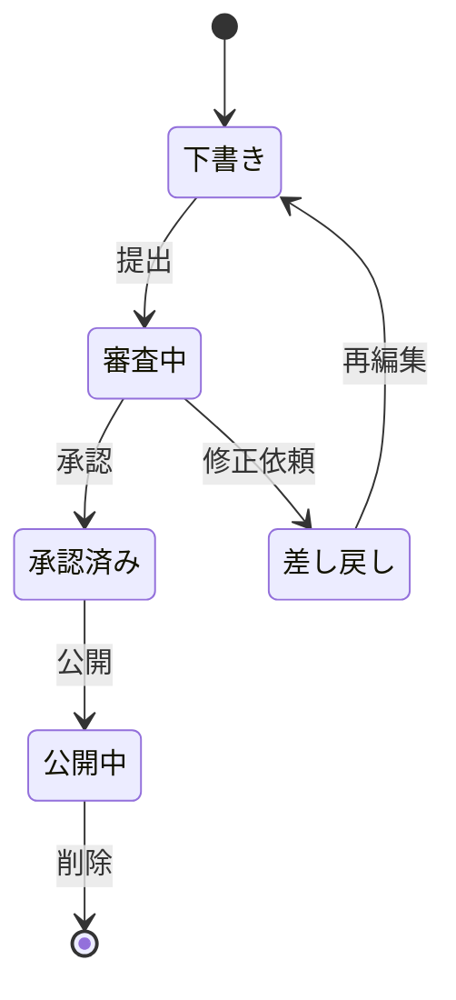
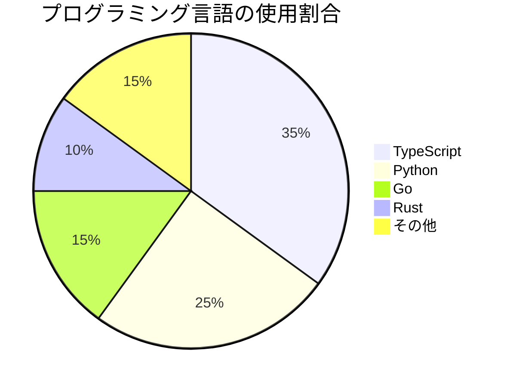
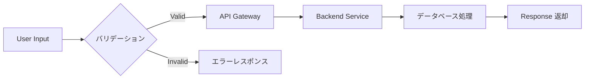

# Mermaid 日本語テスト

日本語を含むMermaid図が正しく表示されることを確認するテストファイルです。

## フローチャート

```mermaid
flowchart TD
    A[開始] --> B{条件分岐}
    B -->|はい| C[処理を実行]
    B -->|いいえ| D[スキップ]
    C --> E[結果を保存]
    D --> E
    E --> F[終了]
```

## シーケンス図

```mermaid
sequenceDiagram
    participant ユーザー
    participant サーバー
    participant データベース
    ユーザー->>サーバー: ログインリクエスト
    サーバー->>データベース: 認証情報を確認
    データベース-->>サーバー: 認証結果
    サーバー-->>ユーザー: ログイン成功
```

## クラス図

```mermaid
classDiagram
    class 注文 {
        +注文番号: string
        +注文日: Date
        +合計金額(): number
        +キャンセル(): void
    }
    class 商品 {
        +商品名: string
        +価格: number
        +在庫確認(): boolean
    }
    class 顧客 {
        +氏名: string
        +メールアドレス: string
        +注文履歴(): list
    }
    顧客 --> 注文 : 作成する
    注文 --> 商品 : 含む
```

## 状態遷移図

```mermaid
stateDiagram-v2
    [*] --> 下書き
    下書き --> 審査中 : 提出
    審査中 --> 承認済み : 承認
    審査中 --> 差し戻し : 修正依頼
    差し戻し --> 下書き : 再編集
    承認済み --> 公開中 : 公開
    公開中 --> [*] : 削除
```

## 円グラフ

```mermaid
pie title プログラミング言語の使用割合
    "TypeScript" : 35
    "Python" : 25
    "Go" : 15
    "Rust" : 10
    "その他" : 15
```

## 英語/日本語混在

```mermaid
flowchart LR
    A[User Input] --> B{バリデーション}
    B -->|Valid| C[API Gateway]
    B -->|Invalid| D[エラーレスポンス]
    C --> E[Backend Service]
    E --> F[データベース処理]
    F --> G[Response 返却]
```

---

テスト完了。上記すべての図で日本語が文字化けせずに表示されることを確認してください。
