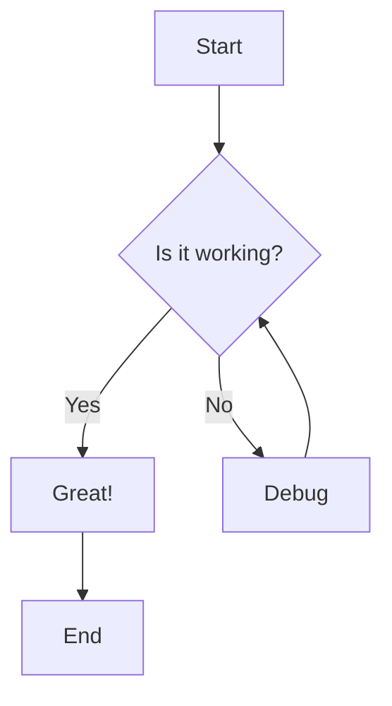
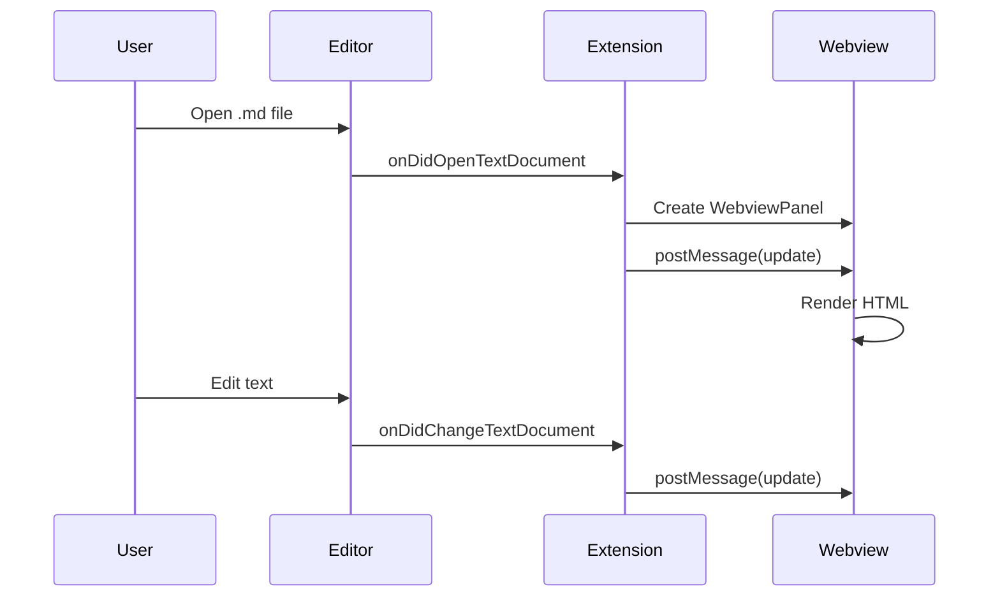
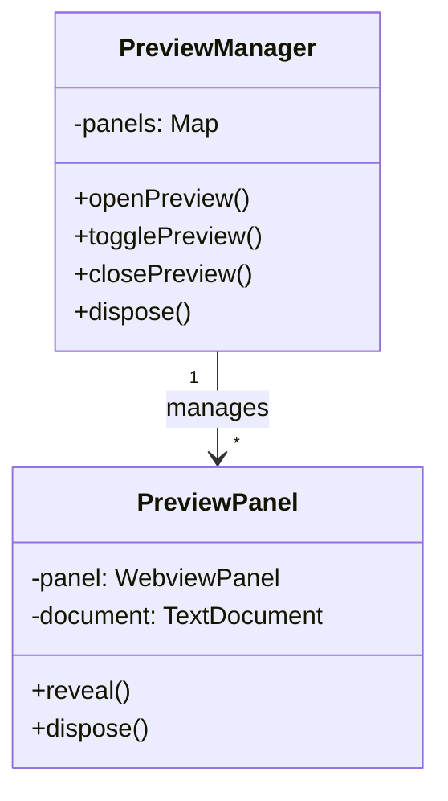
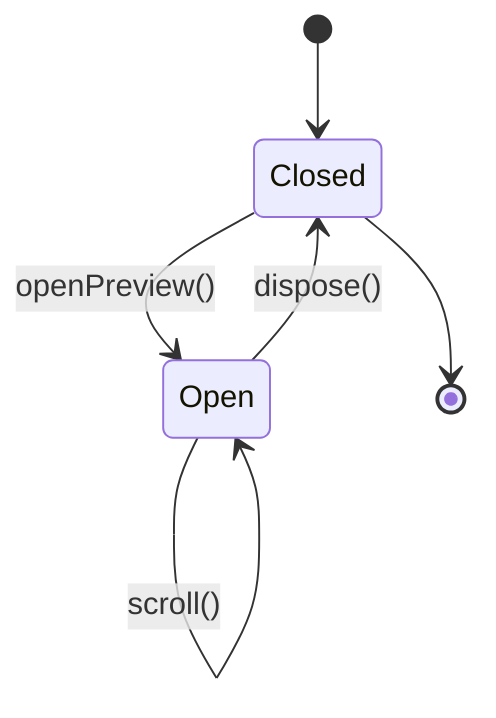
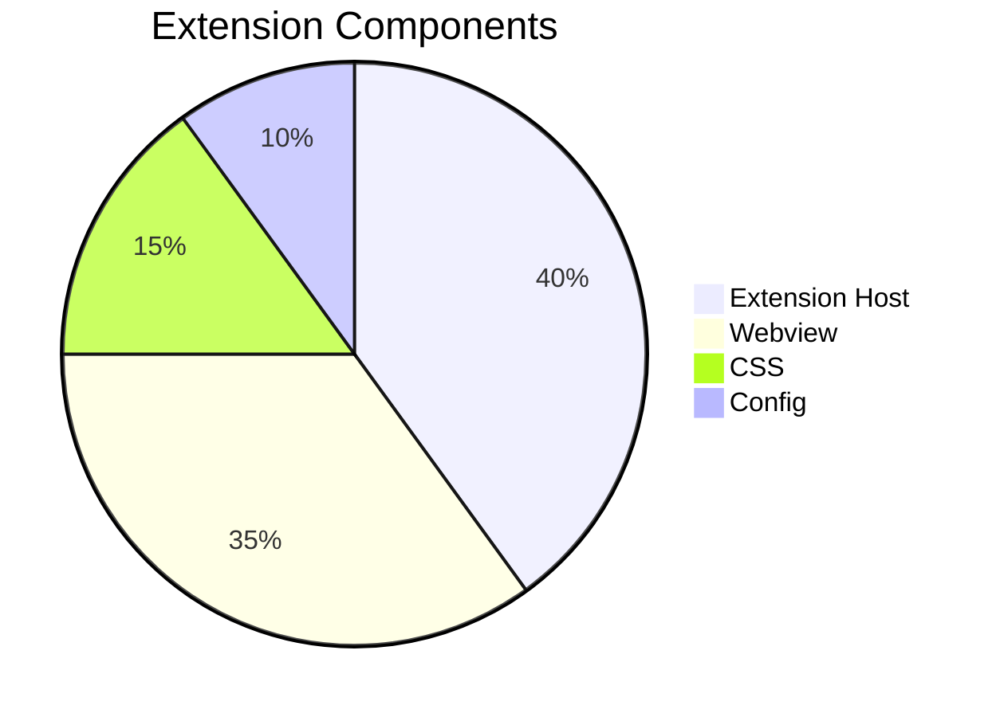

# Mermaid Diagrams Test

## Flowchart



## Sequence Diagram



## Class Diagram



## State Diagram



## Pie Chart



## Invalid Mermaid (Error Test)

```mermaid
graph TD
    A --> B
    this is invalid syntax %%%
    C -->
```
