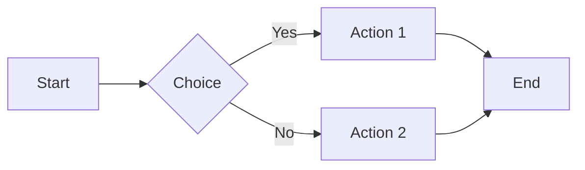
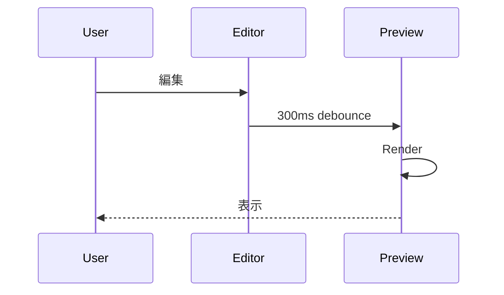

# Pan/Zoom UX Test

Mermaid 図の Pan/Zoom モードを Figma ライクな UX で確認する。

## 動作

| 状態 | wheel | Cmd (Mac) / Ctrl + wheel | ドラッグ |
|:-----|:------|:------------------------|:---------|
| モード OFF | ページスクロール | ページスクロール (効果なし) | 効果なし |
| モード ON | ページスクロール通過 | ズーム (in/out) | Pan (図を移動) |

モード ON は図の右上ボタン (✣ アイコン) または図上でクリックして切替。モード ON 時は図の周囲にフォーカス枠が表示される。

## Mermaid サンプル

## もう一つ (ズーム動作の比較用)

スクロールして上記図の近くで wheel を動かしても、ページスクロールが止まらないことを確認。
