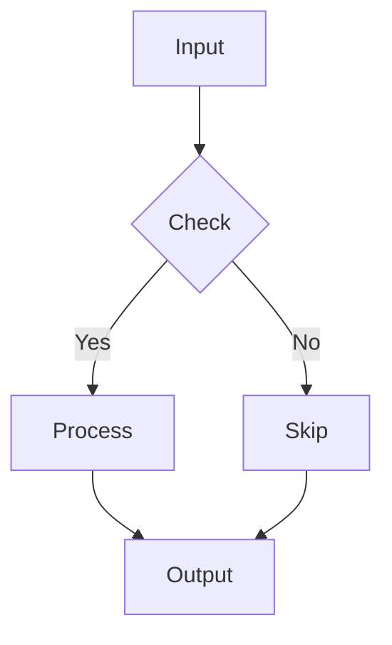

# Soft Theme Test

## Table

| ID | Name | Description |
|----|------|-------------|
| 1 | Alpha | First item |
| 2 | Beta | Second item |
| 3 | Gamma | Third item |

## Code Block

```typescript
function hello(name: string): string {
  return `Hello, ${name}!`;
}
```

## Inline code

This is `inline code` example.

## Blockquote

> これは引用ブロックです。
> 複数行にまたがります。
>
> > ネストされた引用。

## Mermaid



## Horizontal rule

Before the line.

---

After the line.
