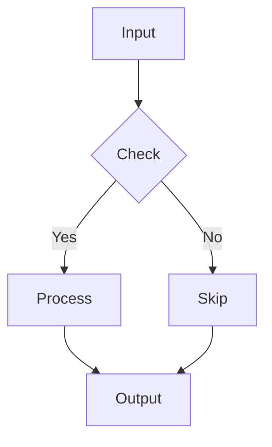

# Soft Theme Test

このファイルは Soft テーマの見た目を確認するためのサンプル。`mdMultiTabPreview.theme.preset` を `"classic"` に切り替えると従来デザインに戻ります。

## GFM Alerts

> [!NOTE]
> 補足・情報提供。青系のアクセントで目立ちすぎずに読ませる。

> [!TIP]
> 便利なコツや推奨事項。緑系の穏やかな強調。

> [!IMPORTANT]
> 重要な情報、見逃してほしくない要点。紫系でやや強い存在感。

> [!WARNING]
> 注意喚起。黄系で目を引き、誤操作を防ぐ。

> [!CAUTION]
> 危険・致命的なエラー。赤系で最も強いトーン。

### 複数行のコンテンツを含む Alert

> [!IMPORTANT]
> 重要な情報は複数行でも自然に続く。
>
> - リストもそのまま表示される
> - ネスト構造や強調 (**太字**, *斜体*) も有効
>
> 段落をまたいでもパディング / 角丸 / 左端のアクセントが一貫する。

## 通常の Blockquote

> これは通常の引用ブロック。Soft テーマでは左の帯が背景カードと一体化して表示されます。
>
> > ネストされた引用も、内側の帯が同じ統合スタイルで表示される。

## Table — 多行ゼブラストライプ

| # | Feature | Category | Priority | Status | Notes |
|---|---------|----------|----------|--------|-------|
| 1 | Auto Preview | Core | P0 | Pass | F-01 |
| 2 | Multi Panel | Core | P0 | Pass | F-02 |
| 3 | Toggle | Core | P0 | Pass | F-03 |
| 4 | Mermaid | Rendering | P1 | Pass | F-04 |
| 5 | Real-time Update | Core | P0 | Pass | F-05 |
| 6 | Scroll Sync | UX | P1 | Pass | F-06 |
| 7 | Syntax Highlight | Rendering | P1 | Pass | F-07 |
| 8 | Frontmatter | Rendering | P2 | Pass | F-08 |
| 9 | Color Swatch | Rendering | P2 | Pass | F-09 |
| 10 | Pan/Zoom | UX | P2 | Pass | F-10 |
| 11 | Copy Button | UX | P2 | Pass | F-11 |
| 12 | Image Resolve | Rendering | P1 | Pass | F-12 |
| 13 | Soft Theme | Theme | P2 | Pass | New |
| 14 | Rich Diff | Feature | P1 | Pass | New |

偶数行に背景色が載っていることを確認。ホバーで行全体が強調される。

## Table — 配置と強調

| Name | Score | Grade | Comment |
|:-----|------:|:-----:|:--------|
| Alice | 95 | A | Excellent |
| Bob | 82 | B | Good |
| Charlie | 67 | C | Needs improvement |

## Code Block

```typescript
function hello(name: string): string {
  return `Hello, ${name}!`;
}
```

## Inline code

文中の `inline code` や `#ff00ff` のような例。

## Mermaid



## Horizontal rule

Before the line.

---

After the line.
